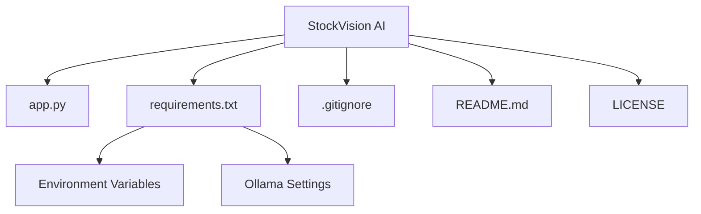

# StockVision AI - Agentic Retail Optimization Platform

**StockVision AI** is an AI-powered agentic platform designed to optimize retail operations, including **demand forecasting**, **inventory monitoring**, and **pricing strategies**. Using a multi-agent architecture and powered by Ollama's LLaMA 3.2 model, StockVision AI enables retailers to make data-driven decisions by forecasting demand, adjusting stock levels, and optimizing prices based on historical trends and competition.

---

## Features

- 🧠 **Multi-Agent System**:
  - **Demand Forecasting Agent**: Predicts future product demand using historical sales data.
  - **Inventory Monitoring Agent**: Tracks stock levels, detects low stock or overstock situations, and suggests reorder actions.
  - **Pricing Optimization Agent**: Adjusts product pricing based on competitor analysis, elasticity, and sales volume.

- 📊 **Real-Time Dashboards**:
  - Visualize demand forecasts, stock levels, and pricing optimization strategies through interactive charts.

- 🧠 **LLM-Powered Reasoning**:
  - Uses **locally hosted LLaMA 3.2 via Ollama** for intelligent, real-time decision-making.

- 🔄 **Custom Dataset Upload**:
  - Upload CSVs for demand, inventory, and pricing data to tailor the predictions and optimizations.

- 📈 **Interactive Chat Interface**:
  - Chat with the system to ask about stock levels, forecasted demand, and optimized pricing.

- 🛠 **Responsible AI**:
  - Transparent decision-making, with clear reasoning paths and human-in-the-loop control.

- 🧠 **Flexible Integration**:
  - Compatible with external data sources or APIs for seamless integration into existing retail systems.

---

## Prerequisites

- **Python**: Version 3.10 or 3.11 (recommended for compatibility).
- **Ollama**: A local instance running the LLaMA 3.2 model for natural language processing.
- **Dependencies**: Listed in the Installation section.
- **Optional**: External data integration for demand, inventory, and pricing (or use sample datasets).

---

## Installation

### Clone the Repository:

```bash
git clone https://github.com/SnehaDeepikaP/StockVisionAI.git
cd StockVisionAI
Set Up a Virtual Environment:
bash
Copy
Edit
python -m venv venv
.\venv\Scripts\activate  # On Windows
source venv/bin/activate  # On macOS/Linux
Install Dependencies:
bash
Copy
Edit
pip install -r requirements.txt
Install Ollama:
Download and install Ollama from ollama.ai.

Run the LLaMA 3.2 model:

bash
Copy
Edit
ollama run llama3.2
Configure Environment Variables:
Create a .env file in the project root:

ini
Copy
Edit
OLLAMA_API_URL=http://localhost:11434/api/generate
OLLAMA_MODEL=llama3.2
(Optional: If you have external data sources, configure them in the .env file.)

Usage
Run the Application:
bash
Copy
Edit
streamlit run app.py
Open your browser to http://localhost:8501 to access the app.
```
Navigate the Interface:
Forecasting: View demand forecasts and visualize sales trends.

Inventory Management: Track stock levels, monitor reorder points, and receive alerts.

Pricing Optimization: Adjust prices based on competitor analysis and market conditions.

Chat with the System: Use the chatbot interface to ask for stock levels, forecasts, and price adjustments.

Testing
Test predefined queries (e.g., “Show me upcoming stockouts” or “What is the forecast for next month?”).

Upload sample datasets for demand, inventory, and pricing to see how the agents react.

Use the interactive chat to simulate real-time queries and check for accurate responses.

Test the integration with external APIs or data sources.

Project Structure

Contributing
Contributions are welcome! Please follow these steps:

Fork the repository.

Create a new branch (git checkout -b feature/your-feature).

Make your changes and commit (git commit -m "Add your feature").

Push to the branch (git push origin feature/your-feature).

Open a pull request.

Please ensure your code follows PEP 8 style guidelines and includes appropriate tests.

License
This project is licensed under the MIT License. See the LICENSE file for details.
